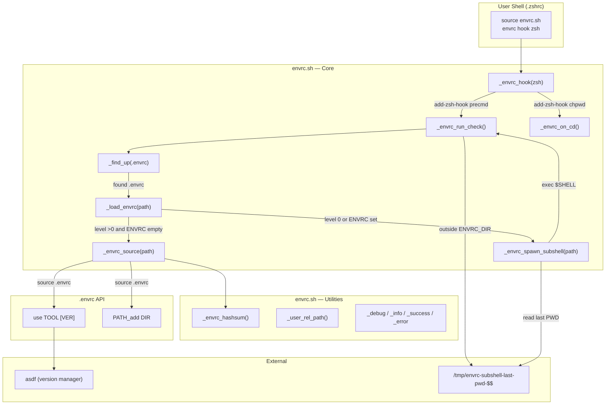
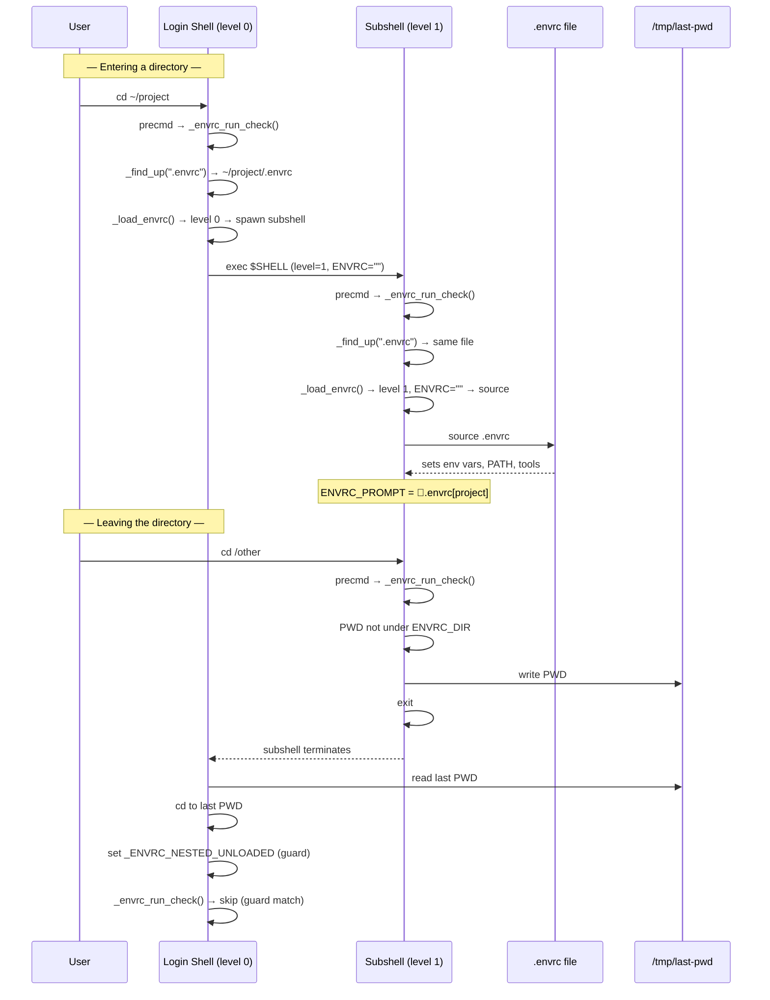
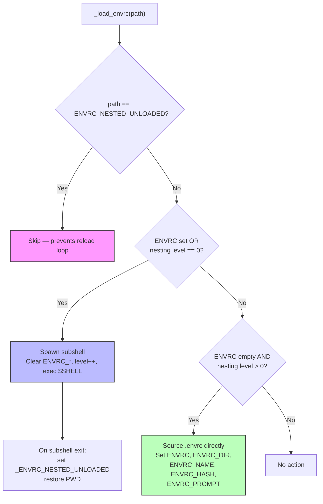
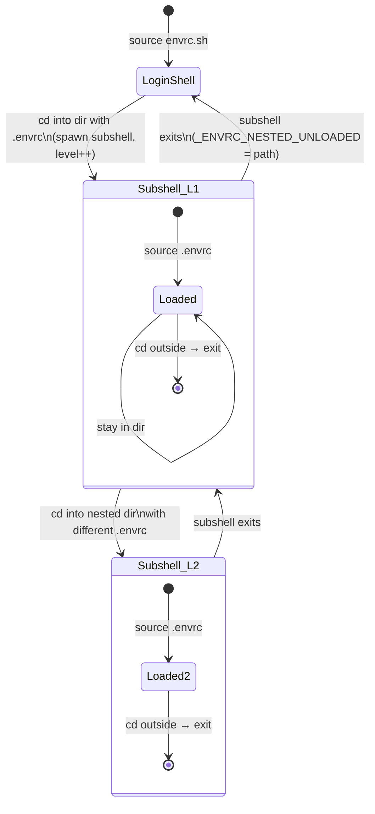

# envrc-tools

A shell integration tool that automatically detects and loads `.envrc` files in **isolated subshells**. Unlike [direnv](https://direnv.net/) (which patches env diffs into your current shell), envrc-tools spawns a new shell process per `.envrc` — cleanup is automatic when the subshell exits.

## Setup

```bash
# In .zshrc:
source ~/path/to/envrc.sh; envrc hook zsh
```

## `.envrc` API

### Functions

- **`use TOOL [VERSION]`** — install and activate a tool version via [asdf](https://asdf-vm.com/). VERSION defaults to `latest`.
- **`PATH_add DIR`** — prepend a directory to `$PATH`.

### Variables

- `$ENVRC_DIR` — the directory containing the `.envrc` being loaded.

### Example `.envrc`

```bash
use golang 1.23.2
use python 3.12.2
use nodejs 22.5.1

source .venv/bin/activate
PATH_add "${ENVRC_DIR}/node_modules/.bin"

export GOPATH=$PWD
```

### Verbosity

Set `ENVRC_VERBOSE` before sourcing `envrc.sh`:

| Level | Output |
|-------|--------|
| 0 (default) | Errors only |
| 1 | + success messages |
| 2 | + info messages |
| 3 | + debug messages |

## Architecture

`envrc.sh` is a self-contained ~200-line script. The key design choice: every `.envrc` environment runs in its own shell process, so exiting the subshell is a clean teardown with no env patching needed.

### Component Diagram



### Lifecycle: Enter & Exit Flow



### `_load_envrc` Decision Tree



### Nesting State Machine



### Key Design Notes

- **Isolation via process stack**: each `.envrc` is a shell process; nesting creates a stack of shells. Clean by design, but deep nesting = many processes.
- **IPC is a temp file**: `/tmp/envrc-subshell-last-pwd-$$` (PID-scoped) passes PWD from exiting subshell to parent.
- **No trust model**: unlike direnv's `allow`/`deny`, any `.envrc` is auto-sourced.
- **Hash unused**: `ENVRC_HASH` is computed but never compared — no hot-reload on `.envrc` edits.
- **Reload guard** (`_ENVRC_NESTED_UNLOADED`): prevents infinite re-spawn when parent rediscovers its own `.envrc` after subshell exit; cleared on next `chpwd`.

## Known Limitations

- No security allowlist — any `.envrc` is sourced automatically
- No change detection — editing `.envrc` requires leaving and re-entering the directory
- Each active `.envrc` is a shell process — deep nesting means a stack of processes
- Loads the nearest `.envrc` walking upward — does not merge or cascade multiple files
